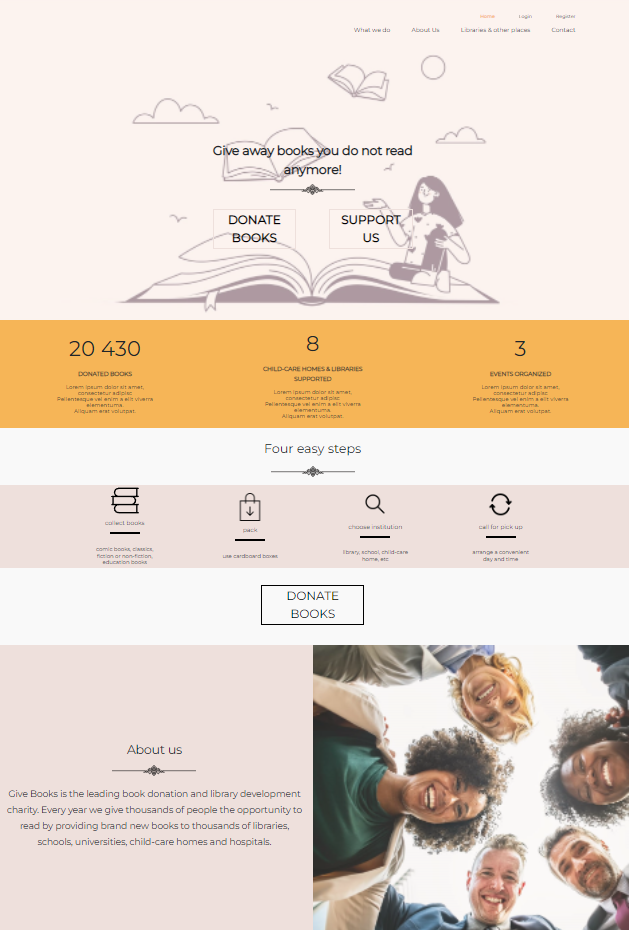

# 📚DESCRIPTION
'Donate BOOKs' is platform that helps to donate books you don't need anymore to those who need them. 
You can donate books to the wild selection of libraries, child-care homes, school and hospitals.
Your books can enrich the lives of others readers.

This project was based on similar project made during PortfolioLab as part of the CodersLab front-end course.

# ▶️DEMO

# 📓TECHNOLOGIES 
* React.js with Hooks, 
* React Router Dom;
* React Scroll;
* Node package manager;
* Sass, 
* HTML, 
* Firebase;

# 👌FEATURES
* Responsive Web Design (RWD)
* Progressive Web Application (PWA)
* Language version: ENG  English is not my native language.
* Pagination for institutions grouped in lists
* Contact form
* Authorization dialogs for: log in, register
* Smooth scrolling and animations

# LICENSE
MIT License

# NEXT STEPS
Adding stepper form (shows progress through numbered steps) containing i.a.:
*customized checkboxes and selects
*selecting toggle buttons
*date and time pickers

# Download and Install
* Use the link from the 'Clone or download' button to download the project.
* In the project directory, type:
npm i
to install necessary dependencies.

* Run:
npm start
to start the app in the development mode.

* Open http://localhost:3000 to view it in the browser.